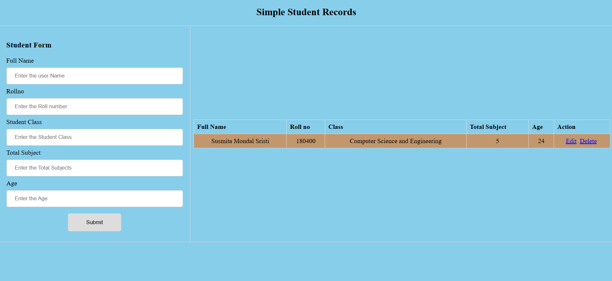

### Student Management System

A robust web-based solution designed for managing student records efficiently—developed as an industrial attachment project.

**Project Features:**
- Add, edit, and delete student records via a user-friendly web form
- Displays student list with sortable columns (name, roll, class, etc.)
- Built with Spring Boot as backend, JS & HTML for interactive UI
- Uses a mock API for simulating live data interactions
- Responsive design for desktop & mobile browsers

**Source Code:**

<a class="github-button" href="https://github.com/SMSristi/student-management-system" data-size="large" aria-label="View Source Code on GitHub">
  View Source Code on GitHub
</a>

#### Screenshots

  

    
    
Student Form & Records

  

