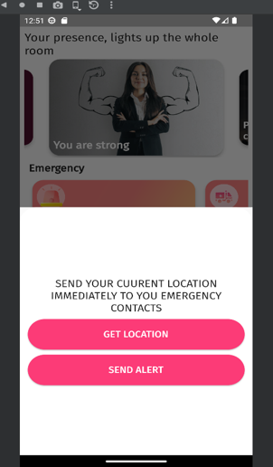
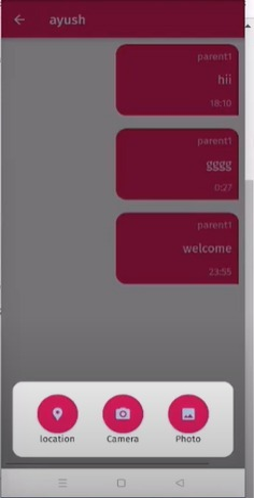
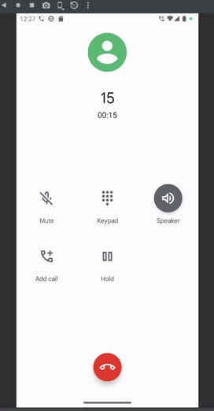
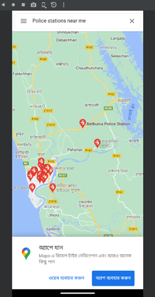

### **{{page.name}}**

A quick-response mobile application to support women's safety in real emergencies.

**Key Features:**
- Get & share current location instantly
- Send alerts, chat, or media to contacts in danger
- Make emergency phone calls from within the app
- Locate police stations on live map view

**Tech Stack:**
- Flutter, Dart, Location APIs (Android/iOS)

**Source Code:**  
 
<a class="github-button" href="https://github.com/SMSristi/women-safety-app" data-size="large" aria-label="View Source Code on GitHub">
  View Source Code on GitHub
</a>

#### Screenshots

  

    
    
SOS/Send Alert

  

  

    
    
Share Location/Media

  

  

    
    
Quick Emergency Call

  

  

    
    
Find Nearby Police

  

